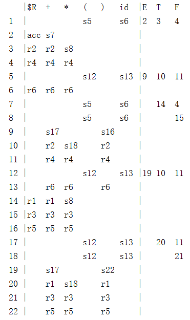

# 基于LR(1)的语法分析器

* GitHub：[https://github.com/AlliamChang/LR1_SyntaxParser](https://github.com/AlliamChang/LR1_SyntaxParser)

目录

1. [实验目的](# 1.实验目的)
2. [内容描述](# 2.内容描述)
3. [思路方法](# 3.思路方法)
4. [假设](# 4.假设)
5. [相关FA描述](# 5.相关FA描述)
6. [重要数据结构](# 6.重要数据结构)
7. [核心算法](# 7.核心算法) 
8. [运行截图](# 8.运行截图)
9. [问题与解决](# 9.问题与解决)
10. [感受与总结](# 10.感受与总结)

## 1.实验目的

实现通用的LR1语法分析器，加深对语法分析过程的理解

## 2.内容描述

此程序用Java编写。程序读取一个规则文件，规则文件的定义在[4.假设](#4.假设)中有描述。程序会将规则文件进行分析，得出相应的PPT(预测分析表)。然后再输入想要分析的字符流，程序就会根据PPT进行规约，并输出相应的规约产生式。
PS.该程序无法分析二义文法。

## 3.思路方法

1. 先定义自己的文法
2. 读取文法(抽取产生式、非终结符、终结符)
3. 构造预测分析表(重复使用closure和goto算法)
4. 输入被分析的字符串流
5. 根据预测分析表得到规约串

## 4.假设

规则文件符合定义

```
输入的格式：
在首行先声明产生式的名字(层次最高的产生式名字放在第一，用大括号包围，逗号分隔名字)：
 {[Name], [Name], ...}

 [Name]: ["[终结符]"|[非终结符]]+
    |    ["[终结符]"|[非终结符]]+
    |    ...
   ...   ...

 e.g. S: "if" S "else" S
      |  "if" S
```


被分析的字符串流的定义

```
输入要分析的内容
以空格为间隔符分隔每个符号
e.g. if abc else ab c
```

## 5.相关FA描述

[DFA](src/main/java/entity/DFA.java)--通过LR1生成的DFA，其中不包含重复的项集

## 6.重要数据结构

除了项集结构(DFA)，还有
* [ItemSet](src/main/java/entity/ItemSet.java)--构造分析表过程中产生的项集结构
* [Item](src/main/java/entity/Item.java)--项集中的项，包含预测集合
* [Production](src/main/java/entity/Production.java)--从规则文件抽离出来的产生式
* [PPT](src/main/java/entity/PPT.java)--生成的预测分析表

## 7.核心算法

构造PPT的算法在[REToLRDFA.java](src/main/java/syntax_parser/REToLRDFA.java)中，包括
* closure()--对项集进行闭包操作
* goto()--计算项集所有的去向
* first()--first算法

## 8.运行截图

根据[test](test)规则文件运行得到的结果

### 预测分析表


### 输入字符串流并分析


## 9.问题与解决

* 项集比较复杂度高

## 10.感受与总结

在编写该实验的过程中，对LR1的算法有了更深入的了解，将LR1的算法输入到计算机中，需要更准确的算法描述，这在手算的时候体现不出来的。也对LR1的整个算法思路更加清晰。